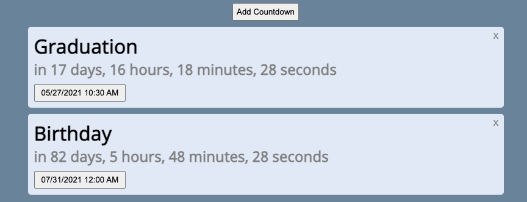

# Countdowns

Countdown timers for important events.

## Usage

* Visit <https://countdowns.brianyu.me/>
* Click "Add Countdown"
* Click the "New Countdown" text to edit countdown title.
* Click the date button to edit the date.

## Features

* Drag-and-drop countdowns to rearrange them.
* Local storage: countdowns persist when page is refreshed.
* Direct link: use query parameters `name` and `time` to create links to add countdowns.

## Author

- [@brianyu28](https://www.github.com/brianyu28)

